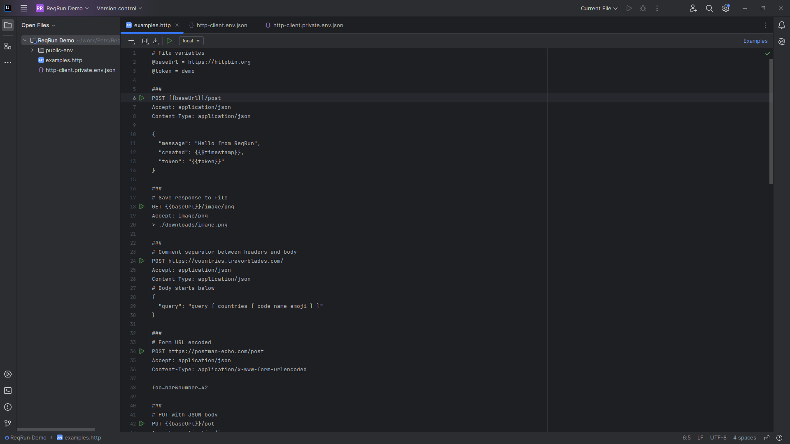
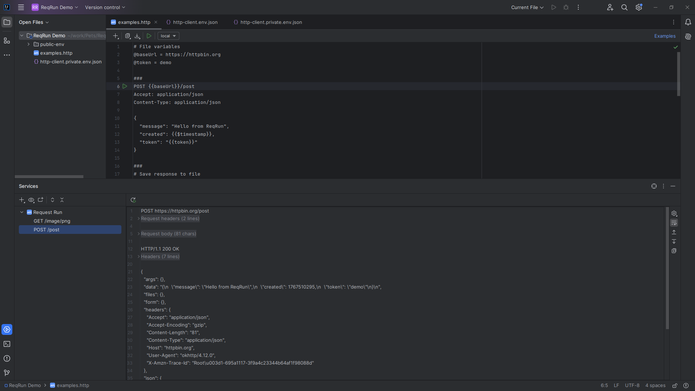
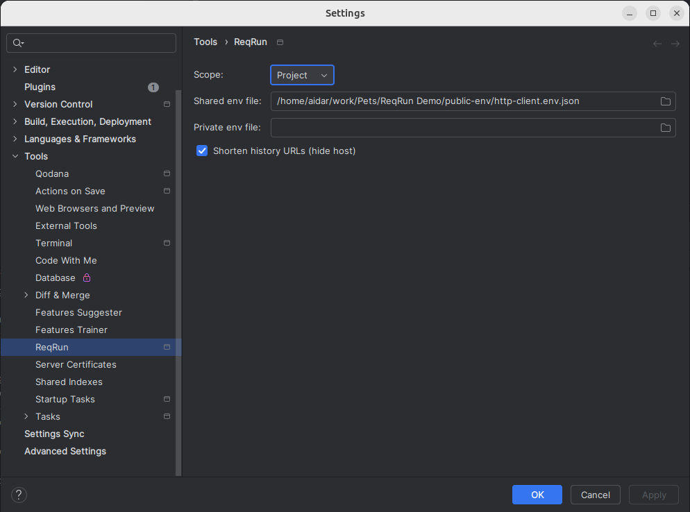
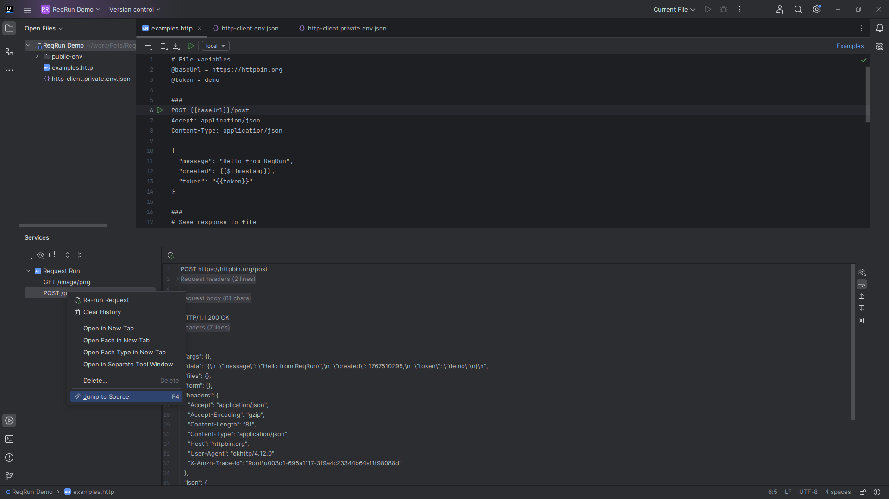
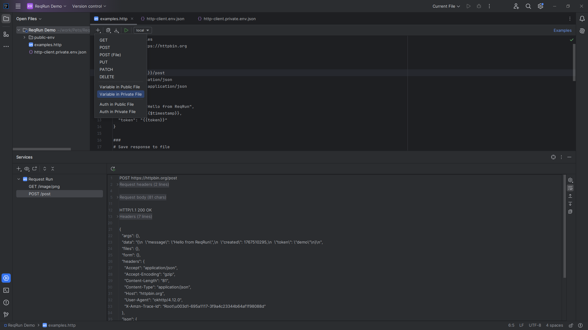
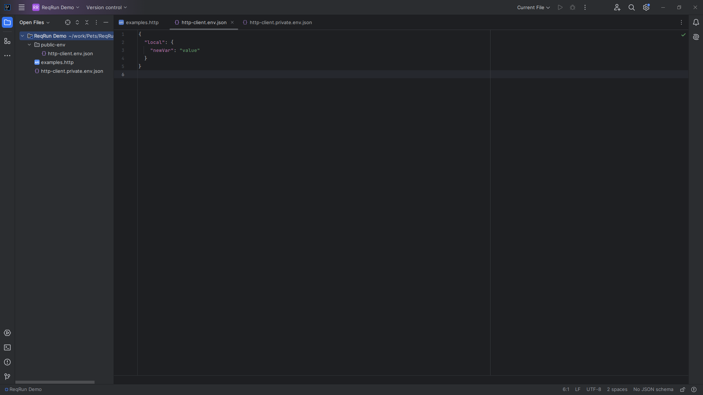
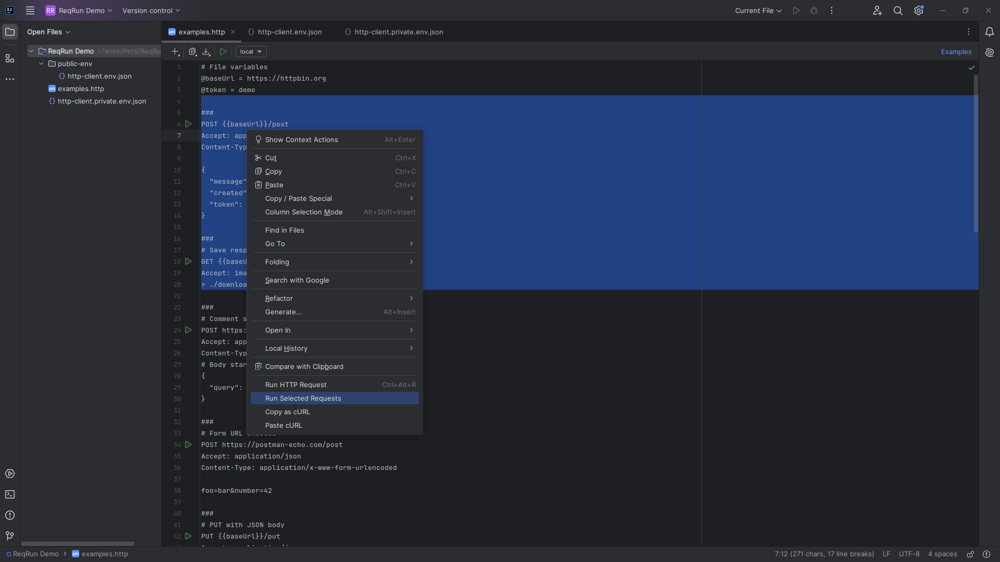
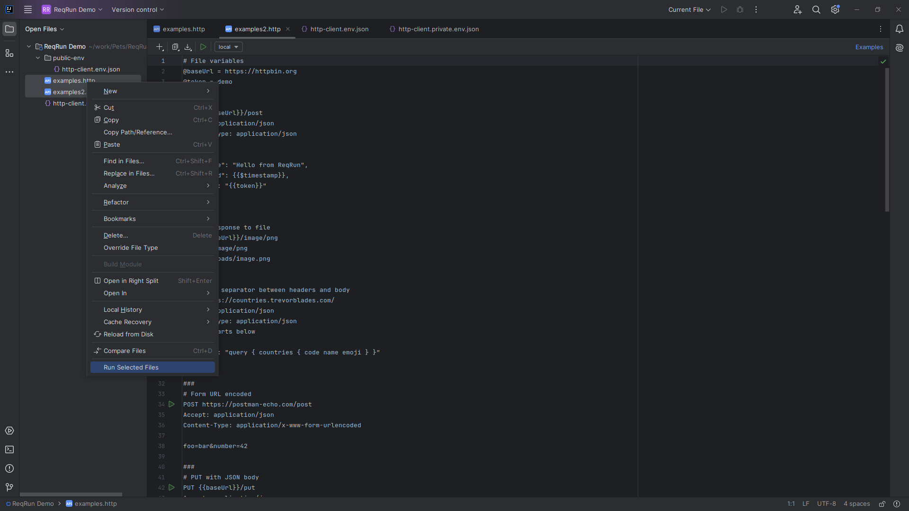

# ReqRun

[](https://plugins.jetbrains.com/plugin/29471-reqrun)
[](https://plugins.jetbrains.com/plugin/29471-reqrun)
[](https://plugins.jetbrains.com/plugin/29471-reqrun)

[](https://plugins.jetbrains.com/plugin/29471-reqrun)
[](https://plugins.jetbrains.com/plugin/29471-reqrun)
[](https://plugins.jetbrains.com/plugin/29471-reqrun)

[](https://github.com/AidarKhusainov/req-run/actions/workflows/main.yml)
[](https://github.com/AidarKhusainov/req-run/actions/workflows/main.yml)

[](https://github.com/AidarKhusainov/req-run/releases)
[](https://github.com/AidarKhusainov/req-run/commits)
[](LICENSE)

<!-- Plugin description -->
ReqRun is a minimal HTTP client for IntelliJ IDEA Community Edition that runs `.http` requests from the editor.

- Run request blocks with gutter icons or `Ctrl+Alt+R`
- Run selections, entire files, or folders of requests
- Inline toolbar for templates, environments, and cURL import/export
- Environments via `http-client.env.json` and `http-client.private.env.json`
- File variables (`@name = value`) and built-in variables (`{{$timestamp}}`, `{{$uuid}}`, `{{$randomInt}}`)
- Static auth configs under `Security.Auth` with `{{$auth.token(...)}}` and `{{$auth.header(...)}}`
- Response viewer with history in the service tool window

```http
GET https://httpbin.org/get
Accept: application/json
```
<!-- Plugin description end -->

A minimal HTTP client for IntelliJ IDEA Community Edition that runs `.http` requests directly from the editor.

## Screenshots

<details open>
<summary>Editor toolbar and gutter actions</summary>

<div align="center">
  
</div>
</details>

<details>
<summary>Response viewer with history</summary>

<div align="center">
  
</div>
</details>

<details>
<summary>ReqRun settings</summary>

<div align="center">
  
</div>
</details>

<details>
<summary>History context menu (re-run, clear)</summary>

<div align="center">
  
</div>
</details>

<details>
<summary>Templates and insert menu</summary>

<div align="center">
  
</div>
</details>

<details>
<summary>Environment file example</summary>

<div align="center">
  
</div>
</details>

<details>
<summary>Editor context actions</summary>

<div align="center">
  
</div>
</details>

<details>
<summary>Run selected files</summary>

<div align="center">
  
</div>
</details>

## Why ReqRun

- Works in IntelliJ IDEA Community Edition without Ultimate APIs
- Keeps requests in plain text files you can version-control
- Fast request execution with clear response viewer and history
- Simple environments and variable resolution with predictable precedence
- cURL import/export for interoperability

## Quick example

```http
GET https://httpbin.org/get
Accept: application/json
```

Place the caret inside the request block and press `Ctrl+Alt+R`.

## Highlights

- Request blocks separated by `###`
- Line comments with `#`
- Run request at caret, selection, file, or folder
- Gutter run icons for request blocks
- Inline toolbar with templates, environment selector, and run-all
- Environment discovery with shared/private merge rules
- File variables and built-in variables
- Static auth configs with helper placeholders
- Unresolved variable warnings before execution
- Response viewer with JSON/XML/HTML/Text view modes
- Response toolbar actions: soft wraps, scroll, copy body
- Header folding and line numbers in the response viewer
- Service tool window history with re-run and clear actions
- Save response to file with `> / >>` and upload with `<`
- Copy as cURL and paste cURL as HTTP

## Documentation

- [Docs index](docs/index.md) - start here
- [Quickstart](docs/quickstart.md) - first request in 5 minutes
- [Request format](docs/request-format.md) - syntax and separators
- [Variables](docs/variables.md) - file, environment, and built-in variables
- [Environments](docs/environments.md) - env files and discovery
- [Static auth](docs/auth.md) - static auth configs
- [Response viewer](docs/response-viewer.md) - response viewer reference
- [cURL import/export](docs/curl-import-export.md) - cURL workflow

## Installation

### From Marketplace

`Settings | Plugins | Marketplace | Search "ReqRun" | Install`

### From Disk

1) Download the plugin ZIP from Marketplace or GitHub Releases
2) `Settings | Plugins | Install plugin from disk...`

## Project

- [CHANGELOG.md](CHANGELOG.md)
- [CONTRIBUTING.md](CONTRIBUTING.md)
- [RELEASING.md](RELEASING.md)
- [GitHub Issues](https://github.com/AidarKhusainov/req-run/issues)
